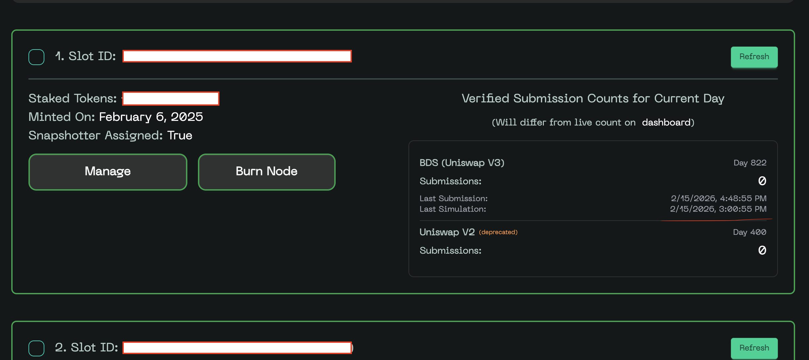

# DSV Mainnet: Snapshotter Lite Node Setup Instructions, Rewards and What's Next

⚠️ *This guide requires the snapshotter CLI to be installed and configured. Please refer to the [Snapshotter CLI documentation](https://github.com/powerloom/snapshotter-lite-multi-setup/blob/31e077b7143eab7e9675043305a3615530f61da1/CLI_DOCUMENTATION.md) for complete installation and usage instructions.*

⚠️ 😤 *If you are impatient, please skip to the [Appendix: Install the snapshotter CLI](#appendix-install-the-snapshotter-cli) section for quick instructions.*


## Configure for BDS Data Market on DSV Mainnet

**🏷️ TIP: You can use the `powerloom-snapshotter-cli configure` command to configure the snapshotter lite node(s) for the BDS Data Market on DSV Mainnet.**

```bash
powerloom-snapshotter-cli configure --env mainnet --market BDS_MAINNET_UNISWAPV3
# or from the shell mode:
powerloom-snapshotter> configure --env mainnet --market BDS_MAINNET_UNISWAPV3
# or with uv:
uv run powerloom-snapshotter-cli configure --env mainnet --market BDS_MAINNET_UNISWAPV3
```

```bash
👉 Enter slot NFT holder wallet address (0x...) (): <slot NFT holder wallet address>
👉 Enter SNAPSHOTTER signer address (0x...) (): <SNAPSHOTTER signer address>
👉 Enter signer private key (): <signer private key>
👉 Enter RPC URL for ETH-MAINNET (): <ETH-MAINNET RPC URL>
👉 Enter Telegram chat ID (optional) (): <Telegram chat ID can be left blank>
👉 Enter local collector P2P port (for gossipsub mesh communication) (8001): <local collector P2P port. Can be left blank, default is 8001>
✅ Created /root/.powerloom-snapshotter-cli/profiles/bds-mainnet-uniswapv3/.env.mainnet.bds_mainnet_uniswapv3.eth_mainnet with following values:
╭─────────────────────────────────────────────────────────────────────────────────────────────────────────────────────────────────────────────── Environment File Contents ───────────────────────────────────────────────────────────────────────────────────────────────────────────────────────────────────────────────╮
< Your environment file contents >
```

## Deploy the snapshotter lite node(s)

```bash
uv run powerloom-snapshotter-cli deploy --env mainnet --market BDS_MAINNET_UNISWAPV3 

🐳 Docker daemon is running.
🚀 Deploying to environment: MAINNET...
✓ Found profile config for market BDS_MAINNET_UNISWAPV3: /home/ubuntu/.powerloom-snapshotter-cli/profiles/default/.env.mainnet.bds_mainnet_uniswapv3.eth_mainnet
ℹ️ No specific slots provided. Fetching all slots owned by 0xabcdefghijklmnopqrstuvwxyz0123456789 on mainnet...
Found N slots for wallet 0xabcdefghijklmnopqrstuvwxyz0123456789 on mainnet: [ . . . ]
ℹ️ Found slots for wallet 0xabcdefghijklmnopqrstuvwxyz0123456789: [ . . . ]

# choose to deploy select or all slots

☑️ Do you want to deploy all of these fetched slots? (y/n) [y]: n
🫸 ▶︎ Enter the start slot ID from the list above to deploy: N1
🫸 ▶︎ Enter the end slot ID from the list above to deploy (or same as start for single): N2
🎰 Targeting slots for deployment: [N1, N2]
🚀 BDS DSV market detected - using branch: master
🚀 Deploying snapshotter nodes for market: BDS_MAINNET_UNISWAPV3...

[ . . . more output . . . ]
----- Deployment Summary -----
✅ Successfully deployed n snapshotter instance(s).
🧹 Cleaning up temporary base snapshotter clone at /home/ubuntu/snapshotter-lite-multi-setup/.tmp_snapshotter_base_clone...
  ✅ Cleanup successful.
```

## Verify running status

> [!NOTE]
> Let us assume slot ID 1234 is one of the slots deployed. The examples follow this assumption.

### Check simulation submission status on dashboard

You can check the simulation submission status on the fully decentralized [Snapshotter Dashboard](https://mint.powerloom.network/). If everything goes well, you should see the simulation submission timestamp appearing within a couple of minutes of the logs as shown in the example sections below.



> [!NOTE]
> The above screenshot is a sample one. Once epoch release goes live on the DSV mainnet for the BDS data market, you will see the actual snapshot submissions appearing on the dashboard.

### Check running Docker containers

```bash
sudo docker ps | grep -iE 'mainnet|collector'
1dce7f01765b   snapshotter-lite-v2-1234-mainnet-bds_mainnet_uniswapv3-eth-snapshotter-lite-v2                "bash -c '\n  rm -f /…"   31 seconds ago   Up 31 seconds                                                                                                                                                                     snapshotter-lite-v2-1234-mainnet-BDS_MAINNET_UNISWAPV3-ETH
03f92f3996ee   snapshotter-lite-v2-1234-mainnet-bds_mainnet_uniswapv3-eth-snapshotter-lite-v2                "bash -c '\n  rm -f /…"   36 seconds ago   Up 36 seconds                                                                                                                                                                     snapshotter-lite-v2-1234-mainnet-BDS_MAINNET_UNISWAPV3-ETH
d4092014c788   snapshotter-lite-v2-1234-mainnet-bds_mainnet_uniswapv3-eth-snapshotter-lite-local-collector   "/snapshotter-local-…"    36 seconds ago   Up 36 seconds           127.0.0.1:8001->8001/tcp, 127.0.0.1:8085->8085/tcp, 127.0.0.1:50051->50051/tcp                                                                            snapshotter-lite-local-collector-mainnet-BDS_MAINNET_UNISWAPV3-ETH
22c4ed99acd3   5f56581c58f2                                                                                        "/snapshotter-local-…"    8 weeks ago      Up 8 weeks              0.0.0.0:50052->50052/tcp, [::]:50052->50052/tcp                                                                                                           snapshotter-core-snapshotter-local-collector-1
```

### Trail snapshotter logs

```bash
# attach to one of the screen sessions
screen -r pl_mainnet_bds_mainnet_uniswapv3_1234

# or check container logs
sudo docker logs -f snapshotter-lite-v2-1234-mainnet-BDS_MAINNET_UNISWAPV3-ETH
```

You should see the snapshotter logs as following indicating simulation submission snapshot generation and submission.

```bash
February 15, 2026 > 13:25:48 | INFO | 🎲 Genesis epoch: querying BDS with epoch 24462489 (latest - 1)| {'module': 'EpochContext'}
February 15, 2026 > 13:25:48 | INFO | 📋 BDS response for active pools: {'snapshot_cid': 'bafkreicy4wnb6rvi72o7yiwejqq5sxku3uc43d3zr7ebxhed5ehldnsrsq', 'epoch_id': 24462489, 'pools': {'0x202A6012894Ae5c288eA824cbc8A9bfb26A49b93': 1, '0x4d68B530920D26c3b01C99fecC19e21011B72bBD': 1, '0x6546055f46e866a4B9a4A13e81273e3152BAE5dA': 1, '0x6d69DCE31606AbD62C58E95BA984718EEbD540eA': 1, '0x75A5A265D21bC89eC130F18EdDe2b49a4B200dac': 1, '0x88e6A0c2dDD26FEEb64F039a2c41296FcB3f5640': 1, '0xE0554a476A092703abdB3Ef35c80e0D76d32939F': 4, '0xc756BBA710d45647715079cE50aa16aab36deD42': 1, '0xc7bBeC68d12a0d1830360F8Ec58fA599bA1b0e9b': 5, '0xe6ff8b9A37B0fab776134636D9981Aa778c4e718': 1, '0xf31C54cb6F15a5A807Dc33d9dACC2471303D182e': 1}}| {'module': 'EpochContext'}
February 15, 2026 > 13:25:48 | INFO | 🎲 Genesis epoch (epoch 0) - slot 1234 processing pool: 0x<POOL_ADDRESS>| {'module': 'PairTotalReservesProcessor'}

February 15, 2026 > 13:25:55 | INFO | 📈 [Epoch 24462480-24462480] Pool <POOL_ADDRESS> | Epoch total trade data: totalTradesUSD=0 totalTradesMintBurnUSD=0 totalFeeUSD=0 token0MintBurnVolume=0 token1MintBurnVolume=0 token0MintBurnVolumeUSD=0 token1MintBurnVolumeUSD=0 token0TradeVolume=0 token1TradeVolume=0 token0TradeVolumeUSD=0 token1TradeVolumeUSD=0| {'module': 'PowerLoom|UniswapCore'}
February 15, 2026 > 13:25:55 | DEBUG | [Epoch 24462480-24462480] Pool <POOL_ADDRESS> | Reserves and trade data generated successfully| {'module': 'PowerLoom|UniswapCore'}
February 15, 2026 > 13:25:55 | DEBUG | [Epoch 24462480-24462480] Pool <POOL_ADDRESS> | Creating final base snapshot| {'module': 'PowerLoom|UniswapCore'}
February 15, 2026 > 13:25:55 | INFO | ✅ [Epoch 24462480-24462480] Pool <POOL_ADDRESS> | Base snapshot generated successfully | Total trade: $0.00 | Total fee: $0.00| {'module': 'PowerLoom|UniswapCore'}
February 15, 2026 > 13:25:55 | DEBUG | ✅ [Epoch 24462480-24462480] Pool <POOL_ADDRESS> | Computation completed | Wall time: 1771161955.8083541| {'module': 'EpochContext'}

February 15, 2026 > 13:25:55 | DEBUG | Sending submission to collector...| {'module': 'GenericAsyncWorker'}
February 15, 2026 > 13:25:55 | DEBUG | Snapshot submission creation with request: slotId: 1234
deadline: 3174717
snapshotCid: "bafkreigx5okipomw2qurii4n25u34fjpd5b5gpcbxwm4j3htnxmubgqim4"
projectId: "baseSnapshot:0x<POOL_ADDRESS>:mainnet-BDS_MAINNET_UNISWAPV3-ETH"
| {'module': 'GenericAsyncWorker'}
February 15, 2026 > 13:25:55 | DEBUG | Snapshot submission created: request {
  slotId: 1234
  deadline: 3174717
  snapshotCid: "bafkreigx5okipomw2qurii4n25u34fjpd5b5gpcbxwm4j3htnxmubgqim4"
  projectId: "baseSnapshot:0x<POOL_ADDRESS>:mainnet-BDS_MAINNET_UNISWAPV3-ETH"
}
signature: "c94ad005cc6d5f0999844fdce7955b23a8eb9a7c8ab5bedcc9177912f6c59ead6f2642ed4bcb072cf8ca2f7ba389a1dd48bfe5a4a58ddddae2eae019eefd84251b"
header: "0x999a6932c997573d9b2557ba2188a488c0c993862abd63dacc0471a58a86c2ed"
dataMarket: "0x4198Bf81B55EE4Af6f9Ddc176F8021960813f641"
nodeVersion: "v2.8.0"
protocolState: "0xa1100CB00Acd3cA83a7C8F4DAA42701D1Eaf4A6c"
| {'module': 'GenericAsyncWorker'}
February 15, 2026 > 13:25:55 | DEBUG | Sent message to local collector and received response: message: "Success"
| {'module': 'GenericAsyncWorker'}
February 15, 2026 > 13:25:55 | INFO | Successfully submitted snapshot to local collector: request {
  slotId: 1234
  deadline: 3174717
  snapshotCid: "bafkreigx5okipomw2qurii4n25u34fjpd5b5gpcbxwm4j3htnxmubgqim4"
  projectId: "baseSnapshot:0x<POOL_ADDRESS>:mainnet-BDS_MAINNET_UNISWAPV3-ETH"
}
signature: "c94ad005cc6d5f0999844fdce7955b23a8eb9a7c8ab5bedcc9177912f6c59ead6f2642ed4bcb072cf8ca2f7ba389a1dd48bfe5a4a58ddddae2eae019eefd84251b"
header: "0x999a6932c997573d9b2557ba2188a488c0c993862abd63dacc0471a58a86c2ed"
dataMarket: "0x4198Bf81B55EE4Af6f9Ddc176F8021960813f641"
nodeVersion: "v2.8.0"
protocolState: "0xa1100CB00Acd3cA83a7C8F4DAA42701D1Eaf4A6c"
| {'module': 'GenericAsyncWorker'}
```

### Trail local collector logs

```bash
sudo docker logs snapshotter-lite-local-collector-mainnet-BDS_MAINNET_UNISWAPV3-ETH -f -n 100 2>&1 | grep -i 'mesh'
```

You should see the local collector logs as following indicating submission publication to the DSV mesh network.

```bash
time="2026-02-15T13:25:36Z" level=info msg="✅ Successfully published submission to gossipsub" func="proto-snapshot-server/pkgs/service.(*server).publishToMesh" file="/app/pkgs/service/msg_server.go:751" epoch_id=0 mesh_state=healthy msg_size=717 peer_count=5 project_id="baseSnapshot:0xc7bbec68d12a0d1830360f8ec58fa599ba1b0e9b:mainnet-BDS_MAINNET_UNISWAPV3-ETH" snapshot_cid=bafkreidpfvo6do3lrdrr5f2skmhsbk4nkkkk35ed5ksf7hjd43d4aoqwi4 topic=/powerloom/dsv-mainnet-bds/snapshot-submissions/0 total_connected=162 uptime_seconds=40110
```

## Incentive structure

The incentive structure for the BDS data market on DSV Mainnet is as follows:

* 💰 We start with a DAILY reward pool of **25,000 $POWER** per day.
* 📈 The reward pool will linearly scale with the number of snapshotter nodes successfully coming online, up to **100,000 $POWER** per day.

### What happens to the legacy Uniswap V2 data market?

> [!WARNING] The legacy Uniswap V2 data market will continue to function only until the next 14 days. After that, it will be deprecated and the centralized sequencer will be turned off.
> This is a huge step towards the ultimate goal of Powerloom to be a fully decentralized network, as well as scaling to the next level of data products and services by removing reliance on a centralized sequencer.

Until then, you can continue to run your older nodes as is and accumulate rewards for the next 14 days with the existing DAILY reward pool of **75,000 $POWER** distributed only among those submitting to the legacy Uniswap V2 data market.

➡️ After that, you will need to migrate to the new BDS data market on DSV Mainnet.

## Work distribution algorithm

**BDS (Blockchain Data Services)** is a **per-block, Uniswap V3 data market** on Ethereum mainnet. One epoch = one block (~12 seconds). Each epoch, 1000 slots are deterministically selected from all registered nodes; each selected slot computes one active pool and submits its snapshot. No central coordinator—assignment is verifiable by any observer. Tick and reserve data are cached when the same pool is reassigned to a slot across nearby epochs, reducing RPC load.

### What to expect as an operator 🎯

- 🎲 **Selection rate** – With ~8000 slots and 1000 per epoch, your slot has ~12% chance per epoch. Expect ~36 assignments per hour. No minimum guarantee.
- ✅ **Not selected = normal** – If your slot is not picked for an epoch, the node simply skips work. That is expected.
- 🔔 **Selected + failed** – 3 consecutive selected-but-failed epochs trigger a Telegram alert.
- ⏱️ **Stuck detection** – No activity for 10 minutes flags the node as stuck.

Configure your **Telegram chat ID** during `snapshotter configure` to receive these alerts. Leave it blank to disable.

### Further reading 📚

- [snapshotter-computes README](https://github.com/powerloom/snapshotter-computes/blob/feat/bds_lite/README.md) — deterministic slot selection, incremental reserves cache
- [snapshotter-lite-v2 SLOT_BASED_WORK_DISTRIBUTION.md](https://github.com/powerloom/snapshotter-lite-v2/blob/master/SLOT_BASED_WORK_DISTRIBUTION.md) — full algorithm and health monitoring

## Why per-block Uniswap V3? 🚀

Per-block data unlocks near real-time DeFi feeds—no more polling legacy APIs or cobbling together delayed aggregates. Think **live trade flows** for bots, **instant liquidity snapshots** for market makers, **tick-level analytics** for prediction markets, or **pool activity dashboards** for power users. The BDS data market is built for this: deterministic, verifiable, and designed to scale.

Want to see it in action? The [Powerloom BDS dashboard](https://bds.powerloom.io/) serves live feed data from our devnet activity—a sneak peek at what’s coming to mainnet.


## Appendix: Install the snapshotter CLI

### Option 1: Recommended: Use pre-built snapshotter CLI binary

Head to the latest [release page](https://github.com/powerloom/snapshotter-lite-multi-setup/releases/latest) and download the binary for your platform. Complete instructions are provided in there.

The typical installation path is to copy the downloaded binary to `/usr/local/bin/powerloom-snapshotter-cli` or `/usr/local/bin/snapshotter` and make it executable.

For example, if you are on an x86_64 Linux machine and `v0.2.0` is the latest release, these would be the commands to install the CLI:
```bash
wget https://github.com/powerloom/snapshotter-lite-multi-setup/releases/download/v0.2.0/powerloom-snapshotter-cli-linux-amd64
chmod +x powerloom-snapshotter-cli-linux-amd64
sudo mv powerloom-snapshotter-cli-linux-amd64 /usr/local/bin/powerloom-snapshotter-cli
```

> [!TIP]
> 📚 **Complete instructions on using pre-built snapshotter CLI binary are also available in the [Snapshotter CLI documentation](https://github.com/powerloom/snapshotter-lite-multi-setup/blob/master/CLI_DOCUMENTATION.md#using-pre-built-binaries-recommended).**

> [!WARNING]
> If you are not sure about the architecture of your platform (for eg., ARM64 vs x86_64), it is recommended to use the `uv` package manager with the bundled installer as detailed below to install the CLI.

### Option 2: Use the bundled installer along with `uv` package manager: Alternative

> [!TIP]
> Caveat: With this approach, you will always have to `cd` into the repository directory to run the commands.

#### Clone the latest snapshotter lite multi setup repository

```bash
git clone https://github.com/powerloom/snapshotter-lite-multi-setup.git dsv-mainnet-snapshotter-lite-multi-setup
cd dsv-mainnet-snapshotter-lite-multi-setup
git checkout master
```

#### Run the bundled installer

Run the following script from within the repository directory to install the snapshotter CLI and its dependencies.
```bash
./install-uv.sh
```

If everything went well, you should see the following output:
```bash
🚀 Installing Powerloom Snapshotter CLI with uv...

Installing uv...
downloading uv 0.10.2 x86_64-unknown-linux-gnu
no checksums to verify
installing to /root/.local/bin
  uv
  uvx
everything's installed!

[ . . . more output . . . ]
Installing Powerloom Snapshotter CLI globally...
Installing from source...

Verifying installation...
✅ Installation successful!
Version: Powerloom Snapshotter CLI version: 0.2.0 (pip)

✅ Installation complete!

You can now use any of these commands:
  powerloom-snapshotter-cli
  snapshotter

Try: powerloom-snapshotter-cli --help

To add /root/.local/bin to your PATH, either restart your shell or run:
  source /root/.local/bin/env (sh, bash, zsh)
  source /root/.local/bin/env.fish (fish)
```

As the instructions at the end of the output suggest, you can add the `~/.local/bin` directory to your `PATH` by running the following command:
```bash
source ~/.local/bin/env
```

### Test out the `help` command

You can now run the snapshotter CLI commands by prefixing them with `powerloom-snapshotter-cli` or `snapshotter`. Try out the help command to get started:
```bash
powerloom-snapshotter-cli --help
# or
snapshotter --help
```

You should see the following output:
```bash
 Usage: powerloom-snapshotter-cli [OPTIONS] COMMAND [ARGS]...                                                                                                                           
                                                                                                                                                                                        
 Powerloom Snapshotter Node Management CLI                                                                                                                                              
                                                                                                                                                                                        
                                                                                                                                                                                        
╭─ Options ────────────────────────────────────────────────────────────────────────────────────────────────────────────────────────────────────────────────────────────────────────────╮
│ --version            Show version and exit.                                                                                                                                          │
│ --changelog          Show changelog and exit.                                                                                                                                        │
│ --help               Show this message and exit.                                                                                                                                     │
╰──────────────────────────────────────────────────────────────────────────────────────────────────────────────────────────────────────────────────────────────────────────────────────╯
╭─ Commands ───────────────────────────────────────────────────────────────────────────────────────────────────────────────────────────────────────────────────────────────────────────╮
│ shell      Start an interactive shell session for faster command execution.                                                                                                          │
│ diagnose   Run diagnostics on the system and optionally clean up existing deployments. Use filters to target specific slot IDs, chains, or markets.                                  │
│ deploy     Deploy snapshotter nodes for specified environment and data markets.                                                                                                      │
│ configure  Configure credentials and settings for a specific chain and market combination.                                                                                           │
│ status     Show status of deployed snapshotter instances (screen sessions and Docker containers). Optionally filter by environment and/or data market.                               │
│ check      Check slot status: compare wallet-owned slots against running containers.                                                                                                 │
│ list       Display available Powerloom chains and their data markets                                                                                                                 │
│ identity   Manage chain and market-specific identity configurations via namespaced .env files.                                                                                       │
│ profile    Manage CLI profiles for different wallet configurations                                                                                                                   │
╰──────────────────────────────────────────────────────────────────────────────────────────────────────────────────────────────────────────────────────────────────────────────────────╯
```


### Verify BDS Data Market and DSV Mainnet is available

```bash
powerloom-snapshotter-cli list
# or from the shell mode:
powerloom-snapshotter> list
# or with uv:
uv run powerloom-snapshotter-cli list
```

You should see the following output with the BDS Data Market available for DSV Mainnet as `BDS_MAINNET_UNISWAPV3`.

> [!NOTE]
> The Blockchain Data Services (BDS) data market is the first one being launched on the Decentralized Sequencer-Validator Mainnet network. This specifically serves close to realtime data on Uniswap V3 pools from the Ethereum Mainnet.

```bash
🌐 Available Powerloom Chains
🌐 Available Powerloom Chains
├── DEVNET (Chain ID: 11167, RPC: https://rpc-devnet.powerloom.dev)

[ . . . devnet data markets . . . ]

└── MAINNET (Chain ID: 7869, RPC: https://rpc-v2.powerloom.network)
    ├── BDS_MAINNET_UNISWAPV3 - Source: ETH-MAINNET
    │   ├── Market Contract: 0x26c44e5CcEB7Fe69Cffc933838CF40286b2dc01a
    │   ├── Market Protocol State: 0x1d0e010Ff11b781CA1dE34BD25a0037203e25E2a
    │   ├── P2P mesh (centralized sequencer off)
    │   ├──   Rendezvous: powerloom-dsv-mainnet-bds
    │   ├──   Gossipsub prefix: /powerloom/dsv-mainnet-bds/snapshot-submissions
    │   ├── Compute: https://github.com/powerloom/snapshotter-computes.git (feat/bds_lite) Commit: 225348c
    │   └── Config: https://github.com/powerloom/snapshotter-configs.git (feat/bds_lite) Commit: 8b8296b
    └── UNISWAPV2 - Source: ETH-MAINNET
        ├── [ . . legacy uniswapv2 market . . . ]
```
